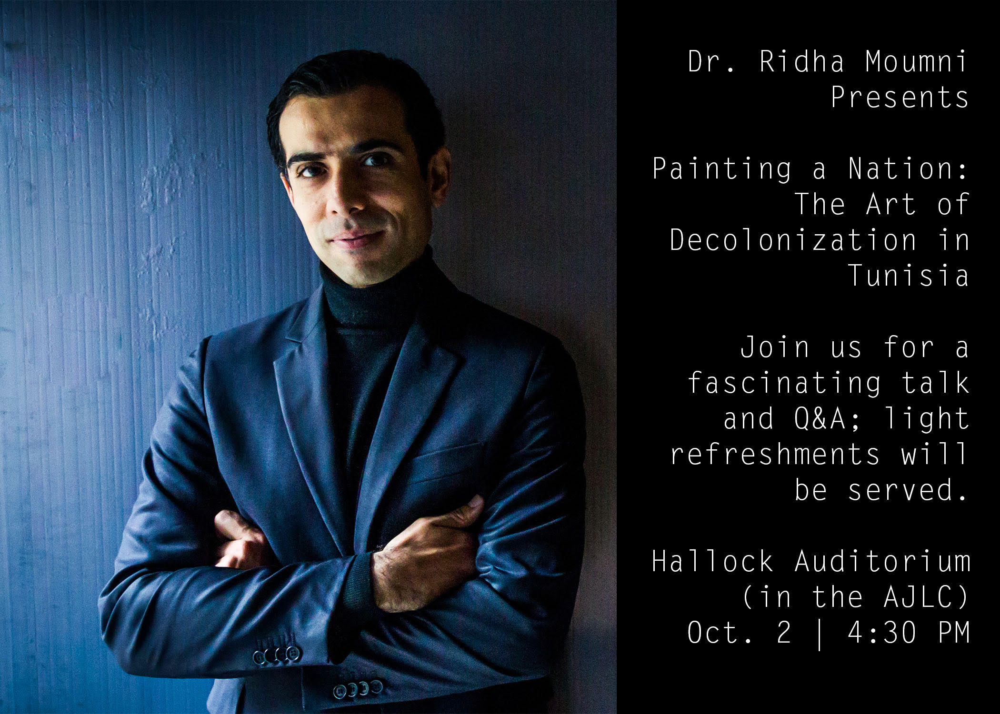

# week04

## Announcements

## Links for this week's discussion

+ [Les Simerables](https://www.jacobinmag.com/2014/10/les-simerables/)
	+ [Magasanti](https://www.youtube.com/watch?v=NTJQTc-TqpU)
+ [Is 'SimCity' Homelessness a Bug or a Feature?](https://motherboard.vice.com/en_us/article/qkvnvm/is-simcity-homelessness-a-bug-or-a-feature)

## Tuesday

+ Discuss
	+ [Les Simerables](https://www.jacobinmag.com/2014/10/les-simerables/)
	+ [Is 'SimCity' Homelessness a Bug or a Feature?](https://motherboard.vice.com/en_us/article/qkvnvm/is-simcity-homelessness-a-bug-or-a-feature)

+ [Unity Quiz](quiz.md)

## Thursday

+ Exhibit Dynamic Simulations homework

+ Short demo on Keyboard Input
	+ [Input.GetKey](https://docs.unity3d.com/ScriptReference/Input.GetKey.html)
	+ [Input.GetAxis](https://docs.unity3d.com/ScriptReference/Input.GetAxis.html)

## Unity Tutorial(s) for this week
+ [Scripting 7-28](https://unity3d.com/learn/tutorials/s/scripting)

## Homework

+ Play (for Tuesday!)
	+ [McDonalds Game](http://www.mcvideogame.com/downloads-eng.html)
	+ [Nova Alea](http://molleindustria.org/nova-alea/)
+ Read (for Tuesday!)
	+ [The Rhetoric of Video Games](http://www.cogsci.rpi.edu/public_html/ruiz/EGDFall2013/readings/RhetoricVideoGames_Bogost.pdf)
+ Create
	+ A soundscape within Unity. This can contain interactive & visual components as well, but sound must be a primary aesthetic aspect. Due Thursday.
